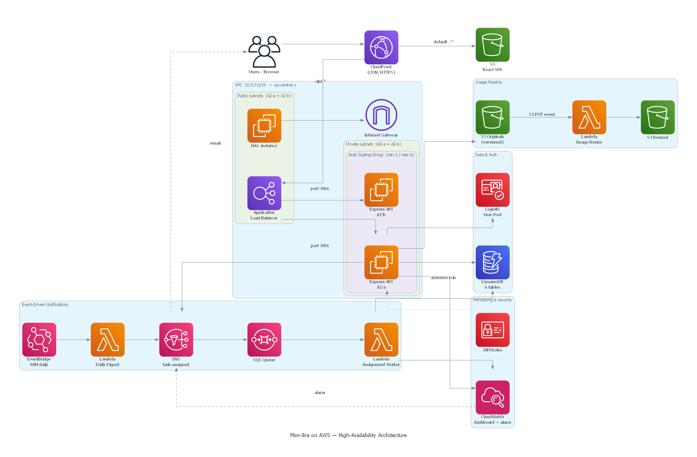

# Mini-Jira on AWS

A lightweight team task-management web application — a stripped-down Jira/Trello —
running fully on AWS. Built for **Software Cloud Computing 2026** (Dr. John Zaki).

Managers create projects and tasks and assign them to employees across multiple
teams; each team sees only its own work. Beyond CRUD, the system uses
event-driven AWS services (SNS, SQS, EventBridge), a Lambda image pipeline, and
CloudWatch monitoring, deployed in a high-availability setup across two
Availability Zones behind an Application Load Balancer and CloudFront.

---

## 🔗 Live Application

> ### 👉 **`https://d31bpiezpvko6a.cloudfront.net/`**
>
> _The CloudFront distribution URL. Clicking it opens the live website directly._

## 🎥 Demo Video

> ### 👉 **[Watch the demo](https://drive.google.com/file/d/1QPq1ZaLKvzdsm4R9S64tSlY6fQ3MEvCi/view?usp=sharing)**

---

## 🏛️ Architecture



The application is deployed for **high availability across two Availability
Zones** in `eu-central-1` (Frankfurt):

- **CloudFront** is the single public entry point. It serves the React SPA from
  an **S3** origin and proxies every `/api/*` request to the **Application Load
  Balancer** — one domain, no CORS.
- The **ALB** lives in **public subnets** across AZ-a and AZ-b and load-balances
  traffic to the backend, running health checks on `/api/health`.
- The **Express API** runs on **EC2 instances in private subnets**, managed by an
  **Auto Scaling Group** (min 2 / max 4) spread across both AZs.
- The EC2 instances reach the internet outbound through a **NAT instance**
  (t2.micro — Free-Tier friendly) in a public subnet.
- All persistence is on **DynamoDB**; **Cognito** handles authentication;
  uploaded images flow through **S3 + Lambda**; task-assignment events fan out
  through **SNS → SQS → Lambda**; **EventBridge** runs a daily digest; and
  **CloudWatch** provides metrics, a dashboard, and an alarm.

The diagram above is generated from [`docs/architecture_diagram.py`](docs/architecture_diagram.py)
using the official AWS architecture icons.

### AWS services and their roles

| Service | Role in the system |
|---------|--------------------|
| **EC2 (Auto Scaling Group)** | Hosts the Node.js/Express backend across 2 AZs. |
| **Application Load Balancer** | Distributes traffic to EC2 instances; health checks. |
| **CloudFront** | CDN in front of S3 (app) and the ALB (`/api/*`). |
| **DynamoDB** | Stores Users, Teams, Projects, Tasks, Comments, ActivityLog. GSIs on `teamId` and `assigneeId`. |
| **S3 (originals)** | Task image attachments; old versions retained via versioning. |
| **S3 (resized)** | Thumbnails produced by the image-resize Lambda. |
| **S3 (frontend)** | Hosts the built React SPA, served via CloudFront. |
| **Lambda — Image Resize** | Triggered by S3 PUT on the originals bucket; writes thumbnails. |
| **Lambda — Assignment Worker** | Drains the SQS queue; writes activity logs; publishes CloudWatch metrics. |
| **Lambda — Daily Digest** | Triggered by EventBridge at 9 AM; emails tasks due today. |
| **SNS** | Fan-out for task-assignment events: email to the assignee + SQS. |
| **SQS** | Buffers assignment events for the worker Lambda. |
| **EventBridge** | Scheduled rule (`cron(0 9 * * ? *)`) for the daily digest. |
| **Cognito** | User pool for sign-up/sign-in; stores `role` and `teamId`. |
| **CloudWatch** | Custom metrics, a 4-widget dashboard, and an overdue-tasks alarm. |
| **IAM** | Least-privilege roles for EC2 and each Lambda. |
| **VPC + Subnets** | Public subnets (ALB, NAT); private subnets (EC2); NAT instance for outbound. |

---

## ✨ Features

- **Role-based access** — Manager (company-wide visibility) and Employee
  (own team only). Admin is merged into Manager.
- **Server-side team isolation** — every API handler enforces the team check;
  employees query a DynamoDB `teamId` GSI and cannot fetch another team's task
  even by guessing its ID. Managers bypass the filter.
- **Full CRUD** — Tasks, Projects, and Comments (create/read on comments).
- **Kanban board** — To Do → In Progress → In Review → Done, with drag-and-drop.
- **Task detail modal** — comments thread, image attachment, and audit log.
- **Image pipeline** — upload, replace (old versions retained), and delete task
  images in S3; a Lambda resizes each upload into a thumbnail.
- **Event-driven notifications** — assigning a task emails the assignee and logs
  the event via an SQS-worker Lambda + a custom CloudWatch metric.
- **Daily digest** — an EventBridge rule emails each assignee their tasks due today.
- **Monitoring** — CloudWatch dashboard (tasks created/closed, time-to-close,
  EC2 CPU) and an alarm for overdue tasks.
- **Polished UI** — Tailwind + shadcn/ui, loading/empty states, error toasts.

---

## 🧪 Demo Scenario

The graded scenario works on demo day without code changes:

1. **Ali** (Manager) logs in → sees all tasks across all teams.
2. Ali creates **Task A**, assigns it to **Sara** (Frontend team).
3. Ali creates **Task B**, assigns it to **Omar** (Backend team).
4. **Sara** logs in → sees **only Task A**; cannot access Task B even by ID (403).
5. **Omar** logs in → sees **only Task B**; can upload an image (Lambda resize).
6. Ali logs back in → sees **both** tasks and can filter by team.

| User | Role | Team |
|------|------|------|
| Ali  | Manager  | (all teams) |
| Sara | Employee | Frontend |
| Omar | Employee | Backend |

---

## 🛠️ Tech Stack

- **Frontend** — React 19, Vite, TypeScript, Tailwind CSS, shadcn/ui,
  `@hello-pangea/dnd`, `amazon-cognito-identity-js`
- **Backend** — Node.js, Express, TypeScript, AWS SDK v3, `aws-jwt-verify`, `multer`
- **Lambdas** — Node.js 20, `jimp` (image resize)
- **Database** — Amazon DynamoDB (6 tables)
- **Auth** — Amazon Cognito User Pool
- **Region** — `eu-central-1` (Frankfurt)

---

## 📁 Repository Structure

```
backend/    Express + TypeScript API (routes, middleware, models, services)
frontend/   React + Vite single-page app
lambdas/    Three Lambda functions: image-resize, assignment-worker, daily-digest
scripts/    DynamoDB table creation, seed data, EC2/NAT deployment user-data
docs/       Architecture diagram + step-by-step AWS deployment guide
```

---

## ⚙️ Deployment & Local Development

The full step-by-step AWS deployment (VPC, subnets, NAT, IAM, ALB, ASG,
CloudFront, etc.) is documented in
**[`docs/aws-setup-guide-m7.md`](docs/aws-setup-guide-m7.md)**.

Run locally:

```bash
# DynamoDB Local must be running on :8000
npm run create-tables          # create the 6 tables locally
npm run seed                    # seed teams + a sample project

cd backend && npm run dev        # API on http://localhost:3001
cd frontend && npm run dev       # SPA on http://localhost:5173
```

---

_Software Cloud Computing 2026 — Mini-Jira on AWS._
